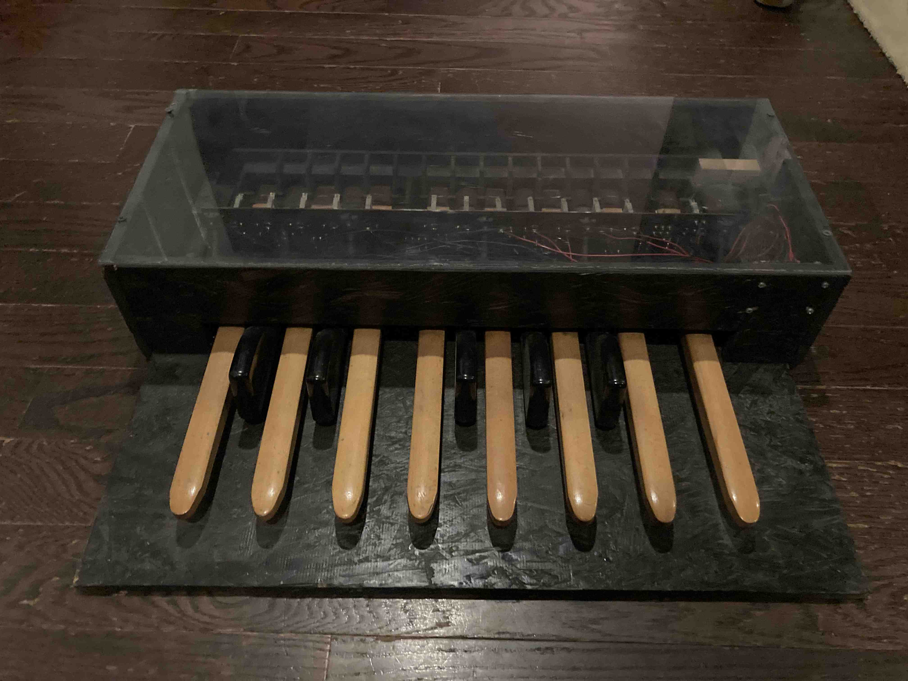
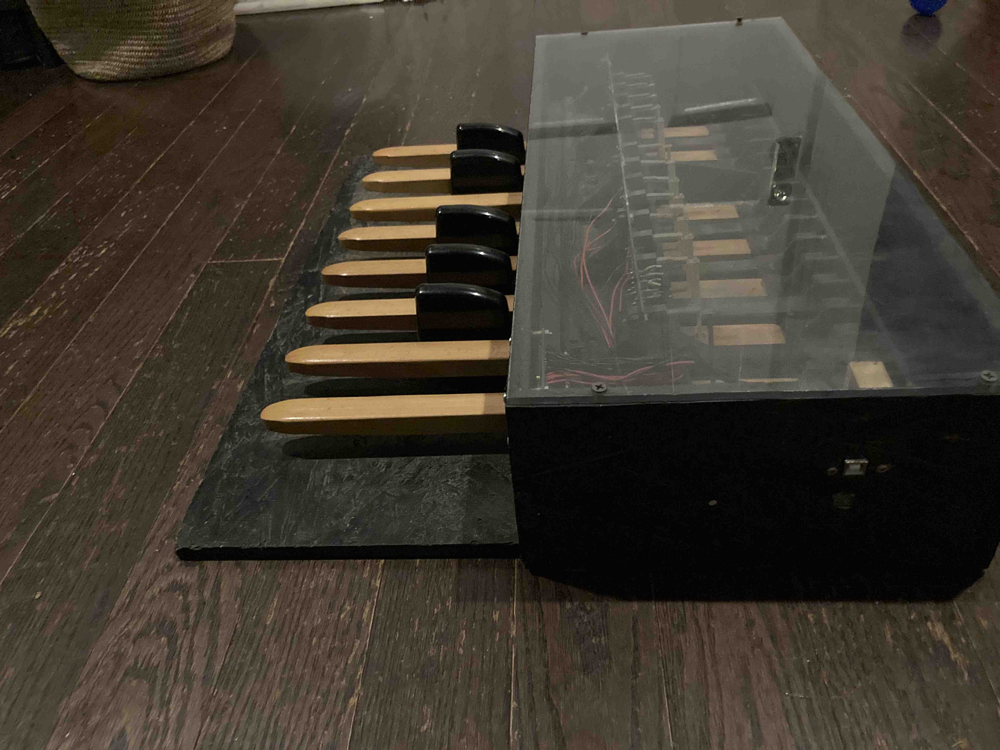

# Organ foot pedals MIDI controller

conversion of an old Wurlizter organ's foot pedals into a MIDI controller using a Teensy microcontroller. 

## quick start guide

* plug in the organ via USB-B cable into your computer. 
* the microcontoller should show up as "Teensy MIDI" in your MIDI devices in your favorite DAW

### technical info
- the keyboard starts on MIDI NOTE 36, or C2. 
- pins used on teensy: {2, 3, 4, 5, 6, 7, 8, 9, 10, 11, 12, 14, 15};
- parts used, Teensy 4.0

## Help
- if you would like to change the midi note, change this line to make the lowest note on the pedals start on whatever note you like:
  
const int baseNote = 36; // C2 

then upload the code to the microcontroller via the Aruino IDE, and Teensyduino. 
